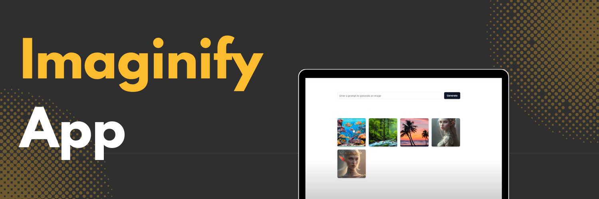

<div align="center">
  <br />
    <a href="https://youtube.com/playlist?list=PLJT1e2CqMCFDjBiXckJXaRUrRCSSLgHHi&si=btNM1wPg1txzIlA0" target="_blank">
      
    </a>
  <br />

  <div>
    
    
    
    
    
  </div>

  <h3 align="center">Imaginify - AI Image Generator</h3>

<div align="center">
     Build this project step by step with a detailed tutorial on <a href="https://www.youtube.com/@codespirit369/videos" target="_blank"><b>Code Spirit</b></a> YouTube. 
    </div>
</div>

## 📋 <a name="table">Table of Contents</a>

1. 🎬 [Introduction](#introduction)
2. ⚙️ [Tech Stack](#tech-stack)
3. 🔋 [Features](#features)
4. 🚀 [Quick Start](#quick-start)

## 🚨 Tutorial

This repository contains the code corresponding to an in-depth tutorial available on our YouTube channel, <a href="https://www.youtube.com/@codespirit369/videos" target="_blank"><b>Code Spirit</b></a>.

<a href="https://youtube.com/playlist?list=PLJT1e2CqMCFDjBiXckJXaRUrRCSSLgHHi&si=btNM1wPg1txzIlA0" target="_blank"></a>

## <a name="tech-stack">⚙️ Tech Stack</a>

- React.js
- Next.js
- Typescript
- TailwindCSS
- OpenJourney
- MongoDB

## <a name="introduction">🎬 Introduction</a>

Welcome to the AI Image Generator app! This application allows you to generate high-quality images based on prompts using the OpenJourney model hosted on Replicate. It's a powerful tool for creators, designers, and anyone who needs custom visuals.

## <a name="features">🔋 Features</a>

👉 **AI-Powered Image Generation**: Generate images by providing descriptive prompts, thanks to the OpenJourney model.

👉 **Image Gallery**: View and manage all generated images within the app.

👉 **Responsive Design**: Optimized for use on various devices, including desktops, tablets, and smartphones.

## <a name="quick-start">🚀 Quick Start</a>

Follow these steps to set up the project locally on your machine.

**Prerequisites**

Make sure you have the following installed on your machine:

- [Git](https://git-scm.com/)
- [Node.js](https://nodejs.org/en)
- [npm](https://www.npmjs.com/) (Node Package Manager)

**Cloning the Repository**

```bash
git clone https://github.com/code-spirit-369/imaginify-openjourney-replicate.git
cd imaginify-openjourney-replicate
```

**Installation**

Install the project dependencies using npm:

```bash
npm install
```

**Set Up Environment Variables**

Create a new file named `.env.local` in the root of your project and add the following content:

```env
REPLICATE_API_TOKEN=
MONGODB_URI=
```

**Running the Project**

```bash
npm run dev
```

Open [http://localhost:3000](http://localhost:3000) in your browser to view the project.
